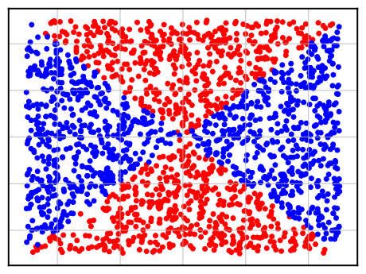

# Max-Affine Spline Insights Into Deep Network Pruning

## For FCNet experiments

* What the task and dataset looks like?

The task is a binary classification task. The sythesized dataset is shown as below figure, where blue dots and red dots refer to two seperate classes and the decision boundary is therefore the X-shape boundary in the 2d dimension input space.

<!--  -->
<p align="center">

</p>


* How to run the code? For example,

````shell
python main.py --net_size 20 --iters 10
````

where `net_size` denotes the hidden units in two layer MLP layers, and `iters` refers to the number of runs to show both the mean accuracy and its variances.

If you want to use lottery initialization to initailize the model, please refer to:

````shell
python main_lt.py --net_size 10 --iters 10
````