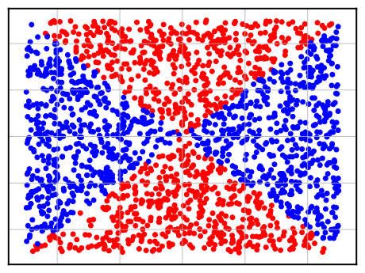
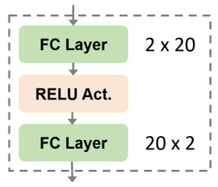

# Max-Affine Spline Insights Into Deep Network Pruning

## For FCNet experiments

* What do the task and dataset looks like?

The task is a binary classification task. The sythesized dataset is shown as below figure, where blue dots and red dots refer to two seperate classes and the decision boundary is therefore the X-shape boundary in the 2d dimension input space.

<!--  -->
<p align="center">

</p>

* What does the network looks like?

The network consists of only two MLP layers with ReLu activation in between. Since the input space is 2-dimensional and the output should also be logits of two classes, the input dimension and output dimension are all two. While the hidden dimension is adjustable and we perform the ablation study over it.

<p align="center">

</p>


* How to run the code? For example,

````shell
python main.py --net_size 20 --iters 10
````

where `net_size` denotes the hidden units in two layer MLP layers, and `iters` refers to the number of runs to show both the mean accuracy and its variances.

If you want to use lottery initialization to initailize the model, please refer to:

````shell
python main_lt.py --net_size 10 --iters 10
````